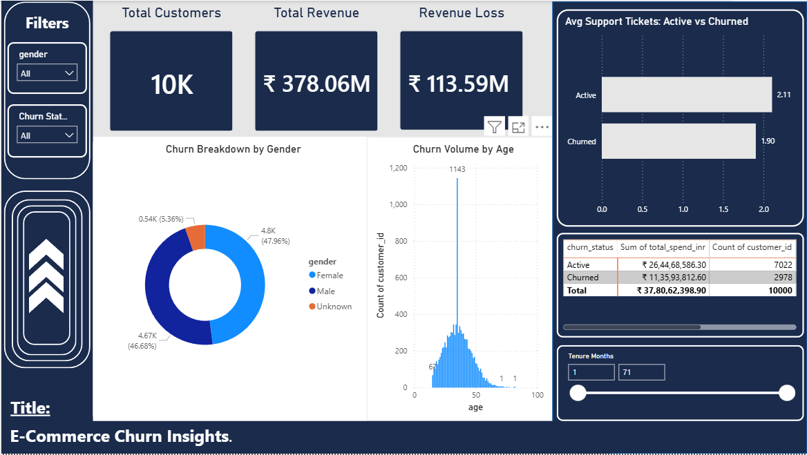

# End-to-End E-Commerce Churn Analytics Pipeline

 

## 📌 Project Overview
This project is an end-to-end data analytics pipeline designed to identify, quantify, and analyze customer churn for an e-commerce platform. Moving beyond basic visualizations, this project encompasses data extraction, Python-based data cleaning, MySQL data warehousing, and a high-density, enterprise-grade Power BI dashboard. 

The primary business objective was to calculate the financial impact of customer churn and discover the underlying operational and demographic causes.

## 💰 The Business Problem
Customer churn is a silent revenue killer. The executive team needed to know:
1. How much total revenue is being lost to churned customers?
2. Who is leaving? (Demographic breakdown)
3. Why are they leaving? (Operational failures vs. Silent abandonment)

## 🚀 Tech Stack & Workflow
1. **Data Cleaning (Python):** Processed raw customer datasets, handled missing values, and standardized categorical variables (e.g., standardizing Gender into Male/Female/Unknown).
2. **Data Warehousing (MySQL):** Engineered a relational database architecture. Imported cleaned datasets and used advanced SQL queries to validate relationships and aggregate high-level metrics prior to visualization.
3. **Data Visualization (Power BI):** Designed a custom, high-density, UI/UX optimized dashboard mimicking a web-app interface for executive stakeholders.

## 📊 Key Business Insights Discovered
* **The Financial Hemorrhage:** Out of 10,000 total users and ₹378.06M in lifetime revenue, **₹113.59M** was permanently lost to churn. Nearly 30% of the potential lifetime value has walked out the door.
* **The "Silent Churn" Phenomenon:** Active customers log *more* support tickets on average (2.11) than churned customers (1.90). This invalidates the assumption that bad customer service interactions cause churn. Instead, it proves that customers who complain are engaged; the highest-risk customers are those who silently disengage.
* **Targeted Demographic Risk:** Churn is completely gender-neutral (~47% Male / ~47% Female), meaning marketing should not gender-target retention campaigns. However, churn volume spikes violently in the **late 20s to mid-30s** demographic, indicating a potential product-market fit issue for young professionals.

## 🖥️ Dashboard UI/UX Features
The Power BI dashboard was designed with corporate stakeholders in mind, utilizing:
* **Custom App-Style Navigation:** A dark-navy sidebar with integrated interactive slicers (Gender, Churn Status, Tenure Months).
* **Executive KPI Header:** "Unbox" style floating KPI cards highlighting Total Customers, Total Revenue, and Revenue Loss.
* **High-Density Widget Layout:** Encapsulated charts with custom borders and transparent backgrounds to maximize data density without visual clutter.
* **Granular Matrix Tables:** Deep-dive tabular data for quick reference of exact customer counts and financial totals by category.

## 📂 Repository Structure
* `/data`: Contains the raw and cleaned datasets (CSV format).
* `/sql`: Contains the MySQL schemas and analytical queries used for data validation.
* `/dashboard`: Contains the `.pbix` Power BI file.
* `README.md`: Project documentation.

## 💡 How to Run This Project
1. Clone the repository to your local machine.
2. Execute the `.sql` scripts in your MySQL Workbench to generate the database.
3. Open the `.pbix` file in Power BI Desktop.
4. If necessary, update the Data Source settings in Power BI to point to your local MySQL server credentials.
